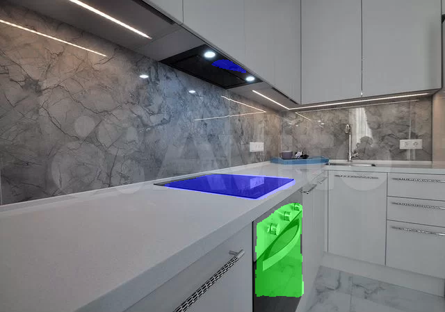

# Семанитческая сегментация изображений кухни

`Pytorch`, `Onnx`, `Docker`, `FastAPI`

Пет проект что бы различать на картинке предметы бытовой техники, а именно 4 класса

- 115 фото размеченных в ручную
- Архитектура `Unet++`
- Бэкбон `ResNet-50`
- Предобучение `Imagenet`
- Лосс `BCE` + `Dice`

В итоге **IoU > 70%**
Должна выглядеть маска для примера так

А еще, обернул это в сервис `FastAPI`, который можно развернуть у себя

Прошу не судить строго, делал за день)